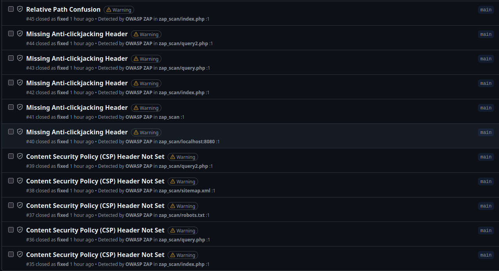

# Secure Cloud Architecture for a Research Website  

## Table of Contents
1. [Introduction](#introduction)  
2. [Capstone Project](#capstone-project)  
    - [2.1. Existing Architecture](#21-existing-architecture)  
    - [2.2. Problems with Existing Architecture](#22-problems-with-existing-architecture)  
3. [Project Objectives](#project-objectives)  
4. [Architectural Design](#architectural-design)  
    - [4.1. Improved Architecture](#41-improved-architecture)  
    - [4.2. System Components](#42-system-components)  
    - [4.3. Networking Layer](#43-networking-layer)  
    - [4.4. Security Boundaries](#44-security-boundaries)  
    - [4.5. Data Layer](#45-data-layer)  
5. [Design Justifications](#design-justifications)  
6. [DevSecOps Security Pipeline](#devsecops-security-pipeline)  
    - [6.1. Pipeline Overview](#61-pipeline-overview)  
    - [6.2. Static Application Security Testing (SAST)](#62-static-application-security-testing-sast)  
    - [6.3. Infrastructure as Code (IaC) Security Scan](#63-infrastructure-as-code-iac-security-scan)  
    - [6.4. Software Composition Analysis (SCA)](#64-software-composition-analysis-sca)  
    - [6.5. Dynamic Application Security Testing (DAST)](#65-dynamic-application-security-testing-dast)  
    - [6.6. Pipeline Results and Reporting](#66-pipeline-results-and-reporting)  

---

## Introduction

This project demonstrates the implementation of a **3-tier cloud architecture** on Amazon Web Services (AWS).  
It is based on the AWS Cloud Architecting Capstone Project and has been extended with additional **DevSecOps** and **security best practices** to ensure compliance with the principles of **least privilege**, **defense in depth**, and **confidentiality of data**.

The system hosts a **PHP-based research website** that allows users to query development statistics from a MySQL database. The architecture was built and deployed using **Terraform**, following Infrastructure-as-Code (IaC) best practices.

---

## Capstone Project

### 2.1. Existing Architecture
The original capstone project deployed a simple PHP application and MySQL database on a single EC2 instance within a public subnet:

### 2.2. Problems with existing architecture
While the project is functional, the adopted architecture suffers from several security and scalability flaws:
- The database and web server share the same EC2 instance, creating a single point of failure.
- The instance is hosted on a public subnet, exposing both the application and database to external threats.
- No network segmentation exists between tiers.
- Database credentials are stored in plaintext within the PHP application.
- Manual provisioning is required, leading to configuration drift and human error.

---

## Project Objectives

The main goals of this project are:
- To design and deploy a **secure 3-tier cloud architecture** on AWS.  
- To apply **DevSecOps principles** throughout the deployment lifecycle.  
- To ensure **network isolation, access control, and credential protection**.  
- To automate infrastructure provisioning through **Terraform**.  
- To create a modular and reusable infrastructure that can serve as a base for similar web applications.

---

## Architectural Design

### 4.1. Improved Architecture
To address the issues with the existing architecture, this project redesigns the solution into a secure, automated, and scalable **3-Tier Cloud Architecture** using AWS best practices:

| Tier | Components | Purpose |
|------|-------------|----------|
| **Presentation Tier (Web)** | Application Load Balancer (ALB), Bastion Host (Public Subnets), NAT Gateway | Handles incoming HTTP traffic and provides secure administrative access. |
| **Application Tier (Logic)** | EC2 Auto Scaling Group (Private Subnets), IAM Roles, Secrets Manager | Hosts the PHP app, retrieves credentials dynamically, and scales horizontally. |
| **Data Tier (Storage)** | Amazon RDS MySQL (Private Subnets) | Stores research data, replicated across AZs for high availability. |

The new Architecture introduces:  
- Network Isolation (public/private subnets)  
- Load Balancing & Auto Scaling  
- Secrets Manager integration  
- IAM least privilege  
- CloudWatch & GuardDuty monitoring  
- Terraform automation  

---

### 4.2. System Components
**Main AWS Components:**
- **VPC (10.0.0.0/16)** for isolation.  
- **Subnets:** 2 public (ALB, Bastion), 2 private (EC2), 2 private (RDS).  
- **Internet/NAT Gateways** for secure access.  
- **Auto Scaling Group** for EC2 resilience.  
- **Secrets Manager** for encrypted credentials.  
- **CloudWatch & GuardDuty** for observability.  
- **IAM Roles** for fine-grained access control.  

---

### 4.3. Networking Layer
Defines an isolated, multi-AZ network ensuring:  
- Internet access only through the ALB and Bastion.  
- EC2 and RDS fully private.  
- High availability via redundant subnets and NAT gateways.  

---

### 4.4. Security Boundaries
Implements layered protection:
- **Security Groups:**  
  - `alb_sg`: allows HTTP from internet.  
  - `ec2_sg`: allows HTTP only from ALB.  
  - `rds_sg`: allows MySQL only from EC2.  
  Direction: Internet → ALB → EC2 → RDS.  

- **IAM Role:**  
  Read-only access to Secrets Manager, ensuring credentials are never hardcoded.  

---

### 4.5. Data Layer
Implements **Amazon RDS (MySQL)** with Secrets Manager-managed credentials:  
- `publicly_accessible = false`  
- Auto-generated password (Terraform `random_password`)  
- Stored as encrypted JSON in Secrets Manager.  

---

## Design Justifications

| Design Decision | Rationale |
|-----------------|------------|
| **3-Tier Architecture** | Improves separation, scalability, and security. |
| **Private Subnets** | Minimizes attack surface. |
| **Security Groups per Layer** | Enforces directional data flow. |
| **IAM Role for EC2** | Secure, temporary credential access. |
| **Secrets Manager** | Centralized, encrypted credentials. |
| **Terraform IaC** | Ensures consistency and version control. |
| **Multi-AZ Deployment** | Fault-tolerant and highly available. |

---

## 6. DevSecOps Security Pipeline

### 6.1. Pipeline Overview

To strengthen security and automation, a **DevSecOps GitHub Actions pipeline** was implemented.  
This pipeline automatically scans the application and infrastructure code for vulnerabilities before any deployment occurs.

**Pipeline Name:** `Security Scan (SAST, SCA & IaC)`  
**Execution Triggers:**  
- On every push or pull request to `main` or `dev` branches.  
- Can be triggered manually (`workflow_dispatch`).  

---

### 6.2. Static Application Security Testing (SAST)

**Tool Used:** [Semgrep](https://semgrep.dev/)  
**Purpose:** Detect insecure code patterns and vulnerabilities in the PHP source code.  
**Configuration:**  
- `config: "p/php"` ensures PHP-specific security rules.  
- Results automatically uploaded to GitHub Security Dashboard.

---

### 6.3. Infrastructure as Code (IaC) Security Scan

**Tool Used:** [Trivy IaC](https://github.com/aquasecurity/trivy)  
**Purpose:** Scan Terraform configurations for misconfigurations and policy violations.  
**Highlights:**  
- Scans the `infra/` directory for AWS resource definitions.  
- Detects public exposure, missing encryption, or overly permissive roles.  
- Results exported in SARIF format for GitHub’s Security Dashboard.

---

### 6.4. Software Composition Analysis (SCA)

**Tool Used:** [Trivy Image Scan]  
**Purpose:** Analyze the Docker image for vulnerable OS packages and dependencies.  
**Key Steps:**
1. Builds the Docker image for the PHP research app.  
2. Scans for known CVEs in system libraries and PHP packages.  
3. Uploads results to GitHub Security Dashboard.  
4. Pipeline fails automatically if **critical vulnerabilities** are found.  

---

### 6.5. Dynamic Application Security Testing (DAST)

**Tool Used:** [OWASP ZAP (Zed Attack Proxy)]  
**Purpose:** Perform runtime security testing on the deployed container to detect:  
- XSS (Cross-Site Scripting)  
- SQL Injection  
- Missing headers / insecure cookies  
- Exposed endpoints  

**Execution Flow:**  
1. Starts the PHP application container locally (`docker run -d -p 8080:80`).  
2. Runs OWASP ZAP full scan via Docker.  
3. Generates reports in JSON, Markdown, and HTML formats.  
4. Converts ZAP JSON report into SARIF for GitHub integration.  
5. Uploads artifacts and fails pipeline if high-risk vulnerabilities exist.

