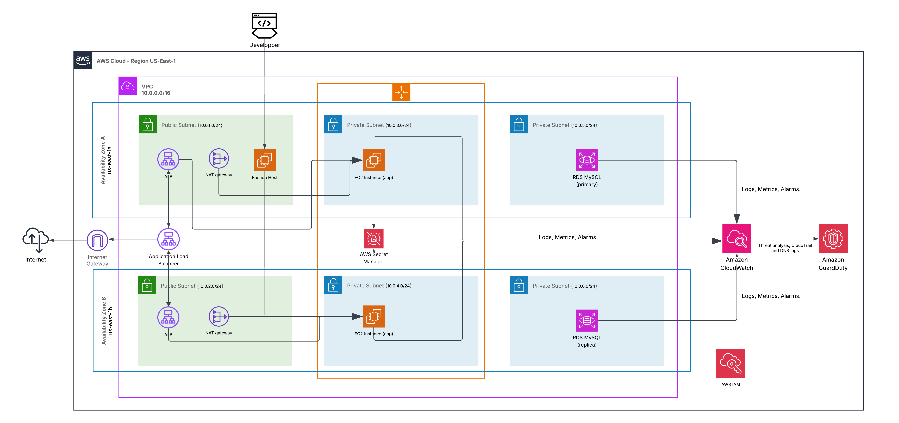

# Secure Cloud Architecture for a Research Website  
*(Based on the AWS Cloud Architecting Capstone Project Website)*  

---

## Table of Contents
1. [Introduction](#introduction)  
2. [Project Objectives](#project-objectives)  
3. [System Overview](#system-overview)  
4. [Architectural Design](#architectural-design)  
   - [4.1. General Overview](#41-general-overview)  
   - [4.2. Networking Layer](#42-networking-layer)  
   - [4.3. Security Boundaries](#43-security-boundaries)  
   - [4.4. Data Layer](#44-data-layer)  
5. [Design Justifications](#design-justifications)  

---

## Introduction

This project demonstrates the implementation of a **secure, scalable, and high-availability 3-tier cloud architecture** on Amazon Web Services (AWS).  
It is based on the AWS Cloud Architecting Capstone Project and has been extended with additional **DevSecOps** and **security best practices** to ensure compliance with the principles of **least privilege**, **defense in depth**, and **confidentiality of data**.

The system hosts a **PHP-based research website** that allows users to query development statistics from a MySQL database. The architecture was built and deployed using **Terraform**, following Infrastructure-as-Code (IaC) best practices.

---

## Project Objectives

The main goals of this project are:
- To design and deploy a **secure 3-tier cloud architecture** on AWS.  
- To apply **DevSecOps principles** throughout the deployment lifecycle.  
- To ensure **network isolation, access control, and credential protection**.  
- To automate infrastructure provisioning through **Terraform**.  
- To create a modular and reusable infrastructure that can serve as a base for similar web applications.

---

## System Overview

The application consists of three primary tiers:

| Tier | Components | Purpose |
|------|-------------|----------|
| **Presentation Tier (Web)** | Application Load Balancer (ALB), Bastion Host (Public Subnets) | Handles all incoming HTTP traffic and provides secure administrative access. |
| **Application Tier (Logic)** | EC2 Auto Scaling Group (Private Subnets), IAM Roles, Secrets Manager | Hosts the PHP application, retrieves credentials dynamically, and ensures horizontal scalability. |
| **Data Tier (Storage)** | Amazon RDS MySQL (Private Subnets) | Stores research data, replicated across Availability Zones for high availability. |

The infrastructure was developed incrementally, with each Terraform module building on the previous one.

---

## Architectural Design

### 4.1. General Overview

The architecture follows a **3-Tier AWS design**, ensuring that each layer is isolated and communicates only with the adjacent layer.  
This approach enhances **security**, **scalability**, and **maintainability**.

**Main AWS Components:**
- **VPC (10.0.0.0/16)**: Defines an isolated network environment for all components.  
- **Subnets:**  
  - 2 Public subnets for ALB and Bastion Host.  
  - 2 Private subnets for EC2 application instances.  
  - 2 Private subnets for the RDS database.  
- **Internet Gateway:** Enables external access through the ALB.  
- **NAT Gateway:** Allows outbound internet access for private subnets (for updates or package installations).  
- **Auto Scaling Group:** Maintains the desired number of EC2 instances based on demand.  
- **Secrets Manager:** Stores and encrypts RDS credentials securely.  
- **CloudWatch & GuardDuty:** Provide centralized monitoring and threat detection.  
- **IAM Roles:** Enforce fine-grained access control to AWS services.

---

### 4.2. Networking Layer

**Purpose:**  
To establish a secure, highly available virtual network environment that isolates public and private resources.

**Resources Implemented:**
- One **VPC (10.0.0.0/16)** for isolation.  
- Four **subnets** across two Availability Zones (public and private).  
- **Internet Gateway** for outbound connectivity of public subnets.  
- **Two NAT Gateways** for controlled outbound access from private subnets.  
- **Route tables** separating public and private traffic.  

**Justification:**  
This configuration ensures that:
- Only the ALB and Bastion Host are reachable from the internet.  
- EC2 instances and the RDS database remain isolated in private subnets.  
- Outbound connectivity for updates is possible through NAT gateways.  
- High availability is achieved through multi-AZ deployment.

---

### 4.3. Security Boundaries

**Purpose:**  
To enforce network and identity boundaries that protect resources from unauthorized access.

**Network-Level Security:**
- **Three Security Groups** were created:
  - `alb_sg`: allows inbound HTTP (port 80) from the internet.  
  - `ec2_sg`: allows inbound HTTP (port 80) only from `alb_sg`.  
  - `rds_sg`: allows inbound MySQL (port 3306) only from `ec2_sg`.  

This directional rule set strictly limits data flow to:
Internet → ALB → EC2 → RDS

**Identity-Level Security:**
- An **IAM Role** was defined for EC2 instances, attached via an **Instance Profile**.  
- The role’s policy grants **read-only access to AWS Secrets Manager** and permission to describe RDS instances.  
- This enables EC2 to retrieve credentials securely without hardcoding them.

**Outcome:**
- The EC2 servers can securely access only what they need.  
- No public access to EC2 or RDS is possible.  
- Credentials are never stored in code or Terraform files.

---

### 4.4. Data Layer

**Purpose:**  
To provide a reliable and secure data storage service using **Amazon RDS (MySQL)** and manage its credentials via **AWS Secrets Manager**.

**Resources Implemented:**
- **RDS Subnet Group** using the private subnets created earlier.  
- **RDS MySQL Instance** (`db.t3.micro`, MySQL 8.0).  
- **Randomly generated password** using Terraform’s `random_password` resource.  
- **Secrets Manager secret** storing username, password, host, port, and database name.  

**Configuration Highlights:**
- `publicly_accessible = false` ensures the database cannot be reached from the internet.  
- Associated with `rds_sg` to allow only app-tier connections.  
- Password generated dynamically and never exposed in plain text.  
- Stored securely in Secrets Manager as JSON.

**Outcome:**
- Database credentials are encrypted, centrally managed, and retrievable only by authorized EC2 instances.  
- The architecture ensures confidentiality and integrity of stored data.  
- Future improvements can enable Multi-AZ deployment for full high availability.

---

## Design Justifications

| Design Decision | Rationale |
|-----------------|------------|
| **3-Tier Architecture** | Improves separation of concerns, scalability, and security. |
| **Private Subnets for EC2 and RDS** | Prevents direct public access and limits attack surface. |
| **Security Groups per Layer** | Enforces directional traffic flow and network isolation. |
| **IAM Role for EC2** | Enables secure API access without hardcoded credentials. |
| **Secrets Manager Integration** | Centralized and encrypted credential storage. |
| **Infrastructure as Code (Terraform)** | Guarantees consistency, repeatability, and easy rollback. |
| **Multi-AZ Availability** | Provides redundancy and fault tolerance. |

